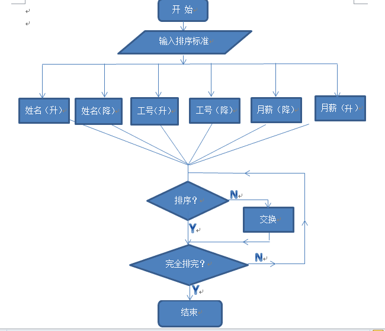

# Payroll-System
# 模拟工资管理系统

管理员密码为B14040215，用户登录ID为工号,初始密码为0215

# 使用帮助

## 管理员：

1）以密码登录系统

2）录入员工信息具体工资，计算相应的税金（计算规则参见最新公布的政策）

3）查询并显示所有的员工具体信息

4）显示统计信息：员工数目，工资总数和税金总数

4）按照指定条件查询

5）增删具体员工记录

税金政策基本是不同收入等级的工资使用不同的比例收取税金。类似于下表：

工资		税金

0～1500		0％

1500～2500	10％（超出部分）

2500～3500	15％（超出部分）

3500～5000	20％（超出部分）

5000～10000	30％（超出部分）

10000～		40％（超出部分）

## 员工：

1）	以工号为登录ID，密码自己设定；

2）	可以查询本人的相关信息；

3）	系统提供指定时间间隔的查询功能。

# 流程图

主要函数流程图：

## （1）执行函数（Execute）：申请一个职工群类，调用所有的函数，程序中所有的步骤都在这里执行（从登录到退出程序）。（见图3-1）

图3-1 执行函数

## （2）添加函数（add）：输入职工信息，用数组存入内存。然后用save()函数保存。

图3-2 添加函数 

（3）保存函数（save）：将输入的信息追加存入到文件中。

图3-3 保存函数

## (4)查找函数（showcur）：根据用户输入的选项，去选择工号、姓名、性别、学历……其中之一进行查找符合要求的所有职工，并输出到屏幕上。

图3-4 查找函数 

## (5)修改函数（Amend）：输入工号以确定要修改的职工，如果存在该职工则再输入要修改的项目，修改完成后保存到文件。

图3-5 修改函数

## （6）排序函数（sort）：输入排序标准，根据姓名、工资等升序降序排序并保存。

图3-6 排序函数

## （7）删除函数（delete）：打开文件，输入工号确定删除的职工，删除后保存。

图3-7 删除函数

## （8）库显示函数（showsaved）：打开文件，读取并显示到屏幕上，关闭文件。

图3-8 库显示函数

##  （9）修改密码（ChangePw）：输入旧密码正确后才能修改，连续输入两次相同新密码才修改成功。

图3-9 修改密码函数
